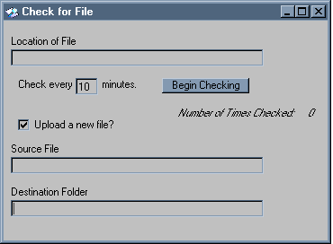



## Check for File / LDB

### Description

I work with Access databases, and occasionally will need to update the front end on the server. With access, you can tell when all users are out when the ldb file is missing. Therefore I created this app that checks for that ldb file. When the file is missing it uploads a specified file to the specified directory.  This works excellent for me so that I can update files when all users are out. Hope this is helpful to you. Feel free to add/change or make suggestions.
 
### More Info
 

             |
---                |---
**Submitted On**   |2002-02-14 10:22:58
**By**             |[Matches](https://github.com/Planet-Source-Code/PSCIndex/blob/master/ByAuthor/matches.md)
**Level**          |Intermediate
**User Rating**    |5.0 (10 globes from 2 users)
**Compatibility**  |VB 6\.0
**Category**       |[Databases/ Data Access/ DAO/ ADO](https://github.com/Planet-Source-Code/PSCIndex/blob/master/ByCategory/databases-data-access-dao-ado__1-6.md)
**World**          |[Visual Basic](https://github.com/Planet-Source-Code/PSCIndex/blob/master/ByWorld/visual-basic.md)
**Archive File**   |[Check\_for\_552722142002\.zip](https://github.com/Planet-Source-Code/matches-check-for-file-ldb__1-31796/archive/master.zip)

